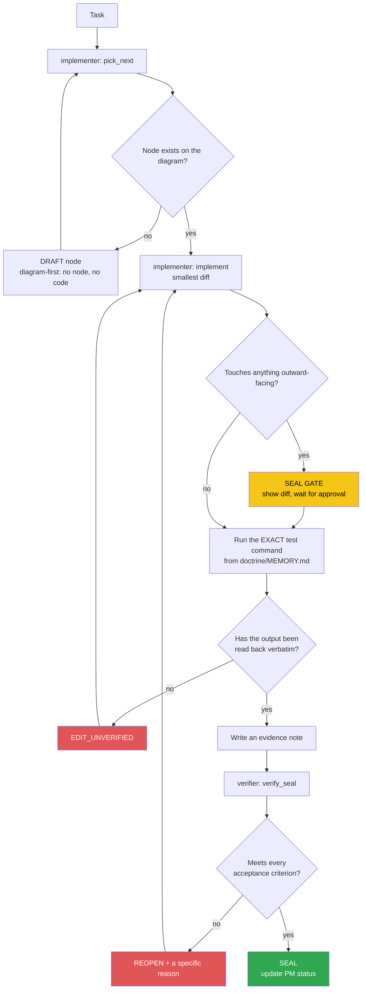

<!-- Diagram: dev-loop -->
<!-- Dev loop: plan - implement - verify - seal -->
DNA: 'smallest_diff / edit_x_read_back_proof_x_independent_verdict'
Auth: 65537 | Version: 1.0.0
Law: LAI-13 - monotonic ratchet (PENDING -> IN_PROGRESS -> SEALED, never demote)

> Every change to the code repo enters here and exits as SEALED or
> REOPENED — no other state in between.

## PM status
> TOKEN DISCIPLINE: this file is read IN FULL every worker session (each
> implementer/verifier subagent loads it fresh). When the table below
> exceeds ~15 SEALED rows or the file exceeds ~15KB: move SEALED nodes
> that are no longer recent work to `dev-loop-archive.md` (same
> directory) — copy the full row over verbatim (DO NOT DELETE, DO NOT
> shorten the original content), then keep only 1 compact line here:
> `| node | state | date — archived, see dev-loop-archive.md. Evidence:
> ... |`. This cleanup is normal hub maintenance, doesn't need to go
> through the worker loop, doesn't need its own evidence note.
>
> `Notes` MUST be a pointer, at most 1 line (e.g. `see
> evidence/implementer/2026-09-20/some-task-plan.md`), must NOT copy
> evidence content (test logs, diffs, REOPEN reasons...) in here — that
> content already exists verbatim in `evidence/`, copying it here
> duplicates exactly what "one home per fact" is meant to block.

| Node | State | Notes |
|---|---|---|
| `bootstrap-agent-hub` | SEALED | see evidence/verifier/2026-09-20/bootstrap-agent-hub-seal.md |

Any regression must be a **new node** (LAI-13) — never edit an old node's
PM status directly to "undo" an existing SEAL.
